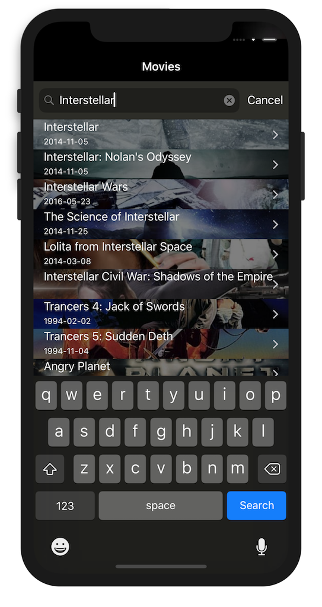
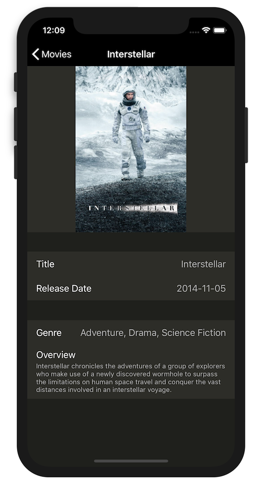
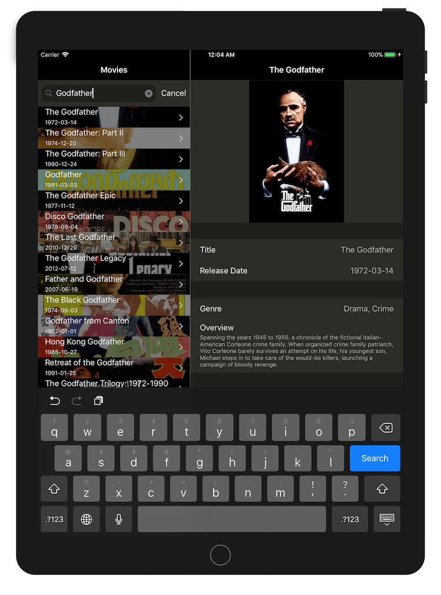

# ReduxMovieDB

## Screenshots
|iPhone (1)|iPhone (2)|iPad|
|----------|----------|----|
||||

## Third-party libraries
1. [ReSwift](https://github.com/ReSwift/ReSwift)

    ReSwift is a Redux-like implementation of the unidirectional data flow architecture in Swift.

2. [RxSwift + RxCocoa](https://github.com/ReactiveX/RxSwift)

    RxSwift and RxCocoa are libraries for composing asynchronous and event-based Apps using observable sequences.

3. [SDWebImage](https://github.com/rs/SDWebImage)

    This library provides an async image downloader with cache support.

## Build instructions

1. An OSX machine
2. Xcode 9.x or higher (Swift 4)
3. Install [CocoaPods](https://cocoapods.org/) (note that you will need to install at least Ruby 2.2.3 for this to work)
```
sudo gem install cocoapods
```
To update cocoapods (not that often needed) run
```
sudo gem update cocoapods
```
4. Clone this repo:
```
git clone https://github.com/cardoso/ReduxMovieDB
```
5. Download library dependencies using the cocoapods dependency manager (and update the same way):
```
pod install
```
6. Do NOT open the Xcode project directly, instead use the ReduxMovieDB.xcworkspace file to open the Xcode workspace.
7. Build the project by ⌘ + R